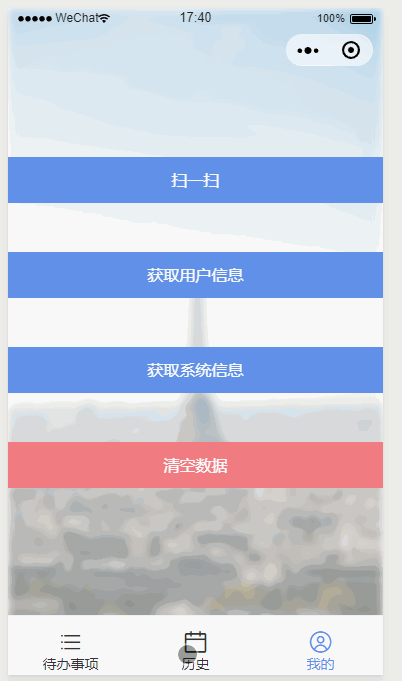

# Taro Test

### 使用 Taro 和 Taro UI 制作的 todoList

### 预览




### 安装

```bash
yarn global add @tarojs/cli

git clone https://github.com/pq1949/taroTest.git

cd taroTest

yarn

npm run dev:weapp (启动微信开发者工具预览)

npm run dev:h5 (h5 适配存在问题 )

```

### 参考

* https://taro.aotu.io/
* https://taro-ui.aotu.io/#/docs/introduction
